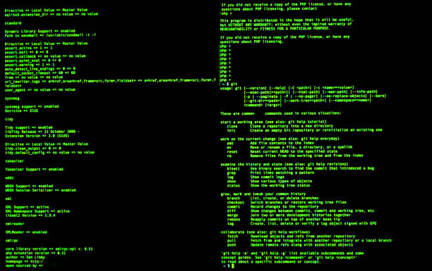

#### Inlämning 1

### Feedback
____
> Det har varit väldigt svårt att ta in all info som vi fått, jag kände mig konfunderad i början men det känns bättre nu och om nånting  börjar det blir roligare då man förstår lite mer. Saker och ting har börjat falla på plats samt så känns det tryggt att ha klasskamrater som hjälper en på traven.

## Några terminalkommandon du lärt dig under föreläsningarna:

- **mv oldnamen newname ;** Detta är för att ändra namn på mappen

- **mkdir ;** Detta är för att skapa en ny mapp

- **echo ;** Detta är föra att skriva en sträng

- **pwd ;** Detta är för att se nuvarande plats 

- **mv ;** Detta är för att flytta och döpa om

- **>> ;** Detta är för att uppdatera 

- **ls ;**  Detta är för att se innehållet i en mapp

- **> ;** Detta är för att skapa en fil

## Några terminal/git-kommandon jag lärt mig själv genom Google:

- **rm filename;** Detta är för att ta bort en fil 

- **git status ;** Detta är för att kolla status

- **git log ;**  Detta är för att visa commited-historiken för den befintliga branchen du är i

- **cd ;** Detta är för att gå till en annan mapp

- **cd .. ;** Detta är för att gå bakåt 

**Länk:** 
 1. https://dzone.com/articles/top-20-git-commands-with-examples
 2. https://www.geeksforgeeks.org/git-cheat-sheet/

>Tyvärr är det inte mycket mer, tycker att ni har varit väldigt duktiga med att ha  lärt ut dem flesta kommandon redan efter några dagar.

## Några git-kommandon du lärt dig under föreläsningarna: 

- **git switch branchname ;** Detta är för att byta till en annan branch 

- **git commit ;** Detta är för att commita

- **git branch ;** Detta är föra tt skapa en branch

- **git init ;** Detta är för att initera en repository

- **git add; ** Detta är för att adda 

## Markdow

- **Bold ;** Detta gör en specifik text tjock

- **--- ;** Detta är för att skapa en streck under en text

- **> ;** Detta är för att markera en kommentar

- **- ;** Detta är för att göra en prick innan en text 

-  1. **# H1 ;** Detta är level 1 storlek på text (Störst)

-  2. **# H2 ;**  Detta är level 2 storlek på text

-  3. **# H3 ;**  Detta är level 3 storlek på text

-  4. **# H4 ;**  Detta är level 4 storlek på text

-  5. **# H5 ;**  Detta är level 5 storlek på text

-  6. **# H6 ;**  Detta är level 6 storlek på text (minst)

**Länk** 
 1. https://www.markdownguide.org/basic-syntax/#line-breaks
 2. https://github.com/adam-p/markdown-here/wiki/Markdown-Cheatsheet#headers

> Såklart finns det mer men det skulle bli då en lång lista. 
> De är några som jag har lärt mig och tycker det är betydligt enklare att skriva texter gemfört med c#. 
